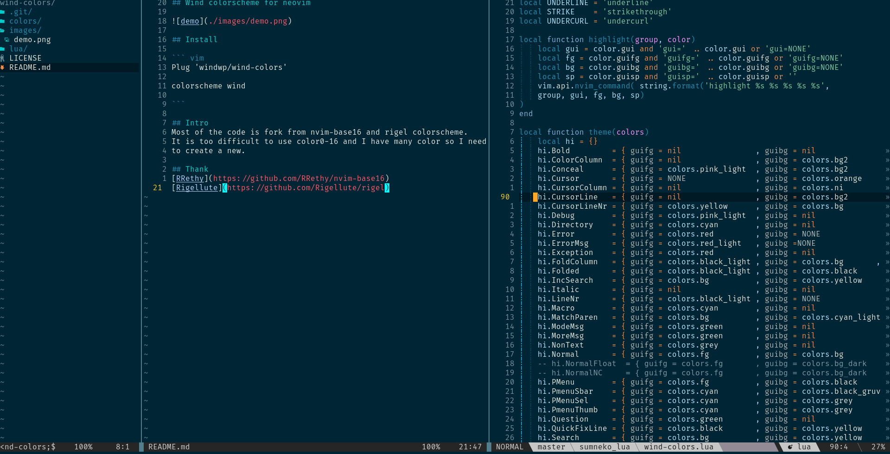

## Wind colorscheme for neovim



## Install

``` vim
Plug 'windwp/wind-colors'

colorscheme wind

```

## Intro
Most of the code is fork from nvim-base16 and rigel colorscheme.
It is too difficult to use color0-16 and I have many color so I need
to create a new.

## Thank
[RRethy](https://github.com/RRethy/nvim-base16)
[Rigellute](https://github.com/Rigellute/rigel)
